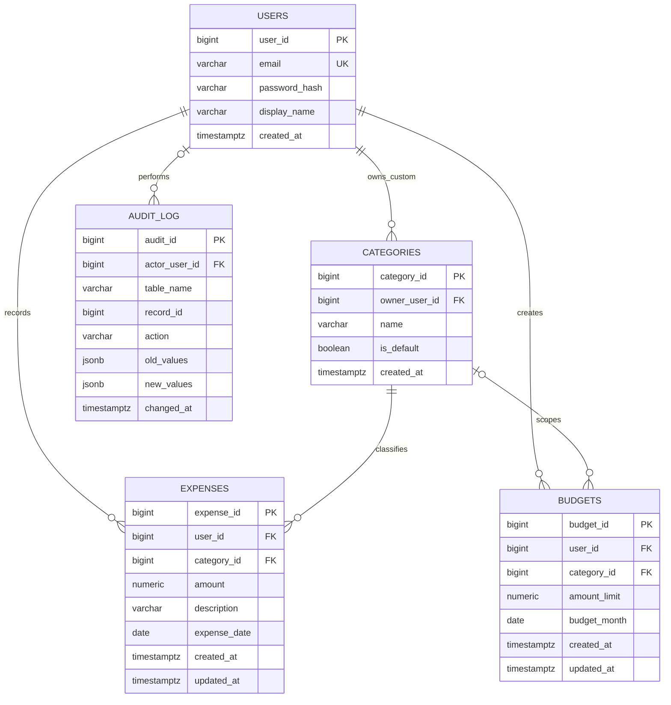

# SpendWise Entity-Relationship Diagram

The following Mermaid diagram describes the approved multi-user database design.

```mermaid
erDiagram
    USERS ||--o{ CATEGORIES : owns_custom
    USERS ||--o{ EXPENSES : records
    USERS ||--o{ BUDGETS : creates
    USERS o|--o{ AUDIT_LOG : performs
    CATEGORIES ||--o{ EXPENSES : classifies
    CATEGORIES o|--o{ BUDGETS : scopes

    USERS {
        bigint user_id PK
        varchar email UK
        varchar password_hash
        varchar display_name
        timestamptz created_at
    }

    CATEGORIES {
        bigint category_id PK
        bigint owner_user_id FK
        varchar name
        boolean is_default
        timestamptz created_at
    }

    EXPENSES {
        bigint expense_id PK
        bigint user_id FK
        bigint category_id FK
        numeric amount
        varchar description
        date expense_date
        timestamptz created_at
        timestamptz updated_at
    }

    BUDGETS {
        bigint budget_id PK
        bigint user_id FK
        bigint category_id FK
        numeric amount_limit
        date budget_month
        timestamptz created_at
        timestamptz updated_at
    }

    AUDIT_LOG {
        bigint audit_id PK
        bigint actor_user_id FK
        varchar table_name
        bigint record_id
        varchar action
        jsonb old_values
        jsonb new_values
        timestamptz changed_at
    }

```
